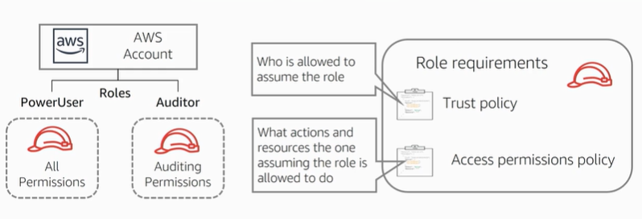

# Domain 1: SDLC Automation

Certification Objectives

* Apply concepts required to automate a CI/CD pipeline
* Determine source control strategies and how to implement them
* Apply concepts required to automate and integrate testing
* Apply concepts required to build and manage artefacts securely
* Determine deployment/delivery strategies (e.g. A/B, Blue/Green, Canary, Red/Black) and how to implement them using AWS services

### Application Lifecycle Management

#### Understanding CI and CD

* Continuous Integration - the practice of continually submitting and verifying our code to automatically process changes
* Continuous Delivery includes integration but includes testing and may include deploying to production
* Continuous Deployment - Removing human interaction from code submission and utilising full automation.

**Continous Integration Goals**

1. Automatically kick off a new release when new code is checked in
2. Build and test code in a consistent, repeatable environment
3. Continually have an artefact ready for deployment
4. Continually close the feedback loop when a build fails

**Continuous Delivery Process**

<figure><figcaption>
Continuous Delivery Flowchart
</figcaption></figure>

**Continuous Deployment Goals**

1. Automatically deploy new changes to staging environments for testing
2. Deploy to production safely without impacting customers
3. Deliver to customers faster: increase deployment frequency, and reduce change lead time and change failure rate

### AWS Code Services

<figure><figcaption>
AWS Code Services
</figcaption></figure>

#### AWS CodeCommit

* Fully managed source-control service
* Hosts secure private Git repositories
* Provides multiple source code repository options
* Scale and collaborate with ease
* Store anything, anytime

This is our repository in AWS that utilises Git. CodeCommit natively integrates with IAM and the data is inherently highly durable.

Ensure you are following the best practices of branching:

* Features and necessary debugging should happen on their own branch, and then should be merged back into the master branch when ready to commit the changes
* Additionally, to avoid merge conflicts with the master branch, you should make small and frequent changes and quickly rejoin them back into the master branch.

<figure><figcaption>
Best practices of branching
</figcaption></figure>

* Checking branches with AWS CloudWatch:
  * Team members make changes and push their code to CodeCommit
  * This action creates a CloudWatch Event
  * This CloudWatch event starts the AWS CodeBuild to begin the build stage

#### AWS CodeBuild

* Fully managed build service
  * Build source from the CodeCommit, S3, Bitbucket and GitHub/GitHub Enterprise
* Build and test code
  * Debug locally with CodeBuild Agent
* Continuous scaling
* Pay as you go

This allows you to build and test your code on scalable infrastructure, managed by AWS, this will be your replacement for your Jenkins environment.

CodeBuild uses a build specification file or buildspec file, for short. This is a YAML formatted file that outlines the necessary steps that CodeBuild must follow.

<figure><figcaption>
Example YAML file.
</figcaption></figure>

**How does AWS CodeBuild work?**

<figure><figcaption>
CodeBuild flowchart
</figcaption></figure>

#### Jenkins as a CI server

Jenkins can be used to handle the build and test processes which could be integrated with or replace CodeBuild:

<figure><figcaption>
Jenkins example
</figcaption></figure>

Understanding the limitations of using Jenkins as it is an unmanaged service on a single EC2 instance could lead to fault tolerance and scalability issues in the architecture.

#### AWS CodeDeploy

* Automate deployments to any instance
  * In the AWS Cloud or on-premises
* Minimises downtime
* Centralised control
* Automatic scaling
* Rapidly release new features

AWS CodeDeploy is a feature that provides us with a direct deployment mechanism for EC2 instances. It works by having a deployment agent installed on the instances in order to handle retrieving components and installing or updating applications.

Note though, CodeDeploy only handles deploying and installing the application and does not do much in the ways of system configuration. Looking at CI/CD pipeline, CodeDeploy is a very functional tool which gives multiple managed deployment options, scalable infrastructure, integration with IAM and the ability to handle deployment verifications.&#x20;

Just as with CodeBuild, CodeDeploy has its own specification file, called the AppSpec file:

<figure><figcaption>
CodeDeploy AppSpec file
</figcaption></figure>

#### Understanding Revisions

When deploying with CodeDeploy, it creates a revision of the application. This revision packages everything together for a deployment, namely:

* The source code files and the AppSpec files.
* This revision is then used by the agent to direct what it is supposed to do, as well as, give it the necessary artefacts that it needs to work with.

<figure><figcaption>
Understanding revisions
</figcaption></figure>

**AWS CodeDeploy: In-place deployment**

A simplified workflow of CodeDeploy and we can see the artefacts that have been uploaded to the repository in use, whether this is Amazon S3 or CodeCommit.

From there, a revision is created in CodeDeploy to outline the tasks that need to be completed and the artefacts we are using.

The agent then evaluates the revision, processes through the AppSpec file and pulls the necessary components and handles the revision on the instance.&#x20;

<figure><figcaption>
AWS CodeDeploy In-place deployment flowchart
</figcaption></figure>

#### Deployment Strategies

For services like AWS CodeDeploy, CloudFormation, AWS Beanstalk, and AWS OpsWorks you can apply several deployment strategies. Each has its pros and cons.

The cheat sheet below shows the types of deployments and shows how well they rank on these columns: impact, deployment time, zero downtime, rollback process, and deploy target.

<figure><figcaption>
AWS DevOps Deployment strategies cheat sheet
</figcaption></figure>

#### AWS CodePipeline

* Automated actions and transitions from check-in to production
* Builds, tests, and deploys your code every time there is a code change
* Provides various development benefits:
  * Faster
  * Safer
  * Consistent and standardised
  * Visualisation of the process

AWS CodePipeline provides CI/CD pipeline orchestration for the automated interaction between the tools and resources being used for integration and deployment.

AWS Pipeline gives you the ability to add a manual approval step

* Pipeline actions look like this:
  * Source - specify where source code is stored: CodeCommit, S3, GitHub
  * Build & Test - specify how the application should be built: CodeBuild, Jenkins, TeamCity
  * Deploy - specify how the application should be deployed: AWS CodeDeploy / AWS CloudFormation / AWS Elastic beanstalk / AWS OpsWorks
  * Test - specify how the application should be tested: AWS CodeBuild, Jenkins, Ghost Inspect
  * Invoke - specify a custom function to invoke: e.g. AWS Lambda
  * Approval - publish the SNS topic for manual approval

